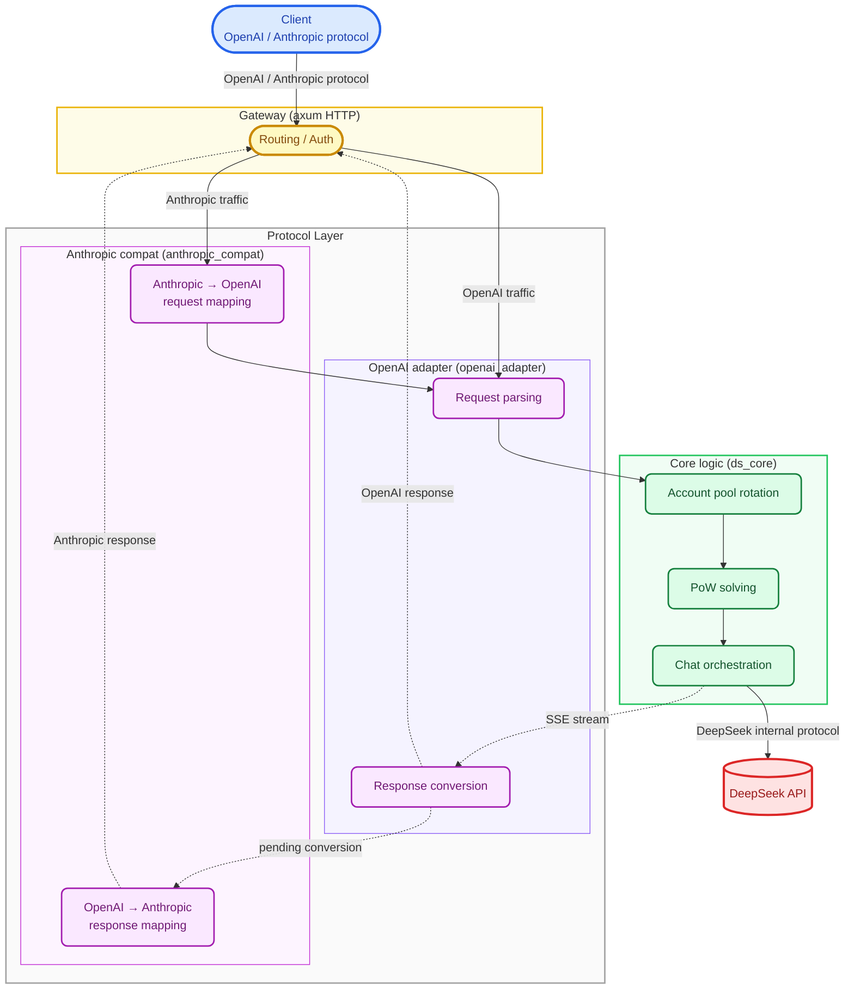

<p align="center">
  
</p>

<h1 align="center">DS-Free-API</h1>

<p align="center">
  <a href="LICENSE"></a>
  
  
  
</p>
<p align="center">
  
  
  
  
</p>

[中文](README.md)

Reverse proxy that adapts and converts free DeepSeek web chat into standard OpenAI / Anthropic compatible API protocols (currently supports chat completions and messages, including streaming and tool calls).

## Highlights

- **Zero-cost API proxy**: Uses DeepSeek's free web chat — no official API key required, drop-in replacement for OpenAI / Anthropic clients
- **Dual protocol**: OpenAI Chat Completions + Anthropic Messages API, works with existing tools and SDKs
- **Tool call ready**: Full function calling support with XML parsing and three-tier self-repair pipeline (text fixes → JSON repair → live model fallback), covering 10+ malformed formats
- **Rust implementation**: Single binary + single TOML config, cross-platform native performance
- **Multi-account pool**: Most-idle-first rotation, automatic session management, horizontal concurrency scaling

## Quick Start

Download the release for your platform from [releases](https://github.com/NIyueeE/ds-free-api/releases) and extract.

```
  .
  ├── ds-free-api          # executable
  ├── LICENSE
  ├── README.md
  ├── README.en.md
  └── config.example.toml  # config template
```

### Configuration

Copy `config.example.toml` to `config.toml` in the same directory as the executable, or use `./ds-free-api -c <config_path>` to specify a config path.

### Run

```bash
# Run directly (requires config.toml in the same directory)
./ds-free-api

# Specify config path
./ds-free-api -c /path/to/config.toml

# Debug mode
RUST_LOG=debug ./ds-free-api
```

Required fields only. One account = one concurrency slot.

> **Concurrency**: DeepSeek's free API enforces rate limits per session (`Messages too frequent. Try again later.`). This project includes built-in mechanisms for stable operation:
> - **Auto rate-limit detection**: Monitors SSE `hint` events for `rate_limit` signals
> - **Exponential backoff retry**: Automatically retries with 1s→2s→4s→8s→16s intervals (up to 6 attempts)
> - **Smart `stop_stream`**: Only fires on client disconnect, skipped on normal completion — prevents request conflicts
> - **Dynamic message_id tracking**: Parses real session IDs from SSE `ready` events, supporting multiple edits within the same session
>
> Verified: 4 accounts + 2 concurrent workers pass all stress scenarios at 100%. 4 accounts + 4 concurrent workers also pass all e2e tests consistently. A single account can also pass all tests thanks to the retry mechanism.
>
> While the system guarantees minimum parallelism = number of accounts (no lock contention), **parallelism = accounts / 2 is recommended** to avoid excessive internal retry latency.

```toml
[server]
host = "127.0.0.1"
port = 5317

# API access tokens, leave empty to disable auth
# [[server.api_tokens]]
# token = "sk-your-token"
# description = "dev test"

# Fill email or mobile (pick one or both). Mobile seems to only support +86 area.
[[accounts]]
email = "user1@example.com"
mobile = ""
area_code = ""
password = "pass1"
```

Here are some free test accounts — please don't send sensitive info through them (the program deletes sessions on cleanup, but leftovers may persist).

```text
rivigol378@tatefarm.com
test12345

counterfeit1341@wplacetools.com
test12345

idyllic4202@wplacetools.com
test12345

slowly1285@wplacetools.com
test12345
```

If you want multiple accounts for concurrency, look into temporary email services (some may not work) and use a VPN to register on the international version.

Recommended temp-mail site: [tempmail.la](https://tempmail.la/) (some domains may not work, try a few times)

## API Endpoints

| Method | Path | Description |
|--------|------|-------------|
| GET | `/` | Health check |
| POST | `/v1/chat/completions` | Chat completions (streaming and tool calls supported) |
| GET | `/v1/models` | List models |
| GET | `/v1/models/{id}` | Get model |
| POST | `/anthropic/v1/messages` | Anthropic Messages API (streaming and tool calls supported) |
| GET | `/anthropic/v1/models` | List models (Anthropic format) |
| GET | `/anthropic/v1/models/{id}` | Get model (Anthropic format) |

## Model Mapping

`model_types` in `config.toml` (defaults to `["default", "expert"]`) maps automatically:

| OpenAI Model ID | DeepSeek Type |
|-----------------|---------------|
| `deepseek-default` | Default mode |
| `deepseek-expert` | Expert mode |

The Anthropic compatibility layer uses the same model IDs, accessed via `/anthropic/v1/messages`.

### Capability Toggles

- **Reasoning**: Enabled by default. To explicitly disable, add `"reasoning_effort": "none"` to the request body.
- **Web search**: Disabled by default. To enable, add `"web_search_options": {"search_context_size": "high"}`.

## Development

Requires Rust 1.95.0+ (see `rust-toolchain.toml`).

```bash
# One-pass check (check + clippy + fmt + audit + unused deps)
just check

# Run tests
cargo test

# Run HTTP server
just serve

# Unified protocol debug CLI
just adapter-cli

# e2e tests (requires server running on port 5317, orthogonal scenarios)
just e2e-basic    # Basic functional (dual endpoints)
just e2e-repair   # Tool call repair scenarios
just e2e-stress   # Multi-iteration stress (all scenarios)

# Start server with e2e test config
just e2e-serve
```

### Architecture overview:



### Data pipelines:

- **OpenAI request**: `JSON body` → `normalize` validation/defaults → `tools` extraction → `prompt` ChatML build → `resolver` model mapping → `ChatRequest`
- **OpenAI response**: `DeepSeek SSE bytes` → `sse_parser` → `state` patch state machine → `converter` format conversion → `tool_parser` XML parsing → `StopStream` truncation → `OpenAI SSE bytes`
- **Anthropic request**: `Anthropic JSON` → `to_openai_request()` → enters OpenAI request pipeline
- **Anthropic response**: OpenAI output → `from_chat_completion_stream()` / `from_chat_completion_bytes()` → `Anthropic SSE/JSON`

### e2e tests

`py-e2e-tests/` is a JSON scenario-driven e2e test framework (requires `uv`). Three tiers:

| Tier | Command | Coverage |
|------|---------|----------|
| **Basic** | `just e2e-basic` | Core scenarios (dual endpoint OpenAI + Anthropic), safe concurrency |
| **Repair** | `just e2e-repair` | Malformed tool call repair scenarios (OpenAI only), safe concurrency |
| **Stress** | `just e2e-stress` | All scenarios × 3 iterations, safe concurrency + 1 |

Scenarios organized by type under `scenarios/`:

```
py-e2e-tests/
├── scenarios/
│   ├── basic/
│   │   ├── openai/         # Core scenarios (chat, reasoning, streaming, tool calls)
│   │   └── anthropic/      # Core scenarios (chat, reasoning, tool calls)
│   └── repair/             # Malformed tool call repair scenarios
├── runner.py               # Single-run entry point
└── stress_runner.py        # Multi-iteration stress entry point
```

Safe concurrency is calculated from `config.toml` account count (`max(1, accounts ÷ 2)`), api_key is auto-extracted.

**Recommended**: Run e2e tests before submitting a PR.

## License

[Apache License 2.0](LICENSE)

[DeepSeek official API](https://platform.deepseek.com/top_up) is very affordable. Please support the official service.

This project was created to experiment with the latest models in DeepSeek's web A/B testing.

**Commercial use is strictly prohibited** to avoid putting pressure on official servers. Use at your own risk.

~~DeepSeek is still China's number one model!!!~~
